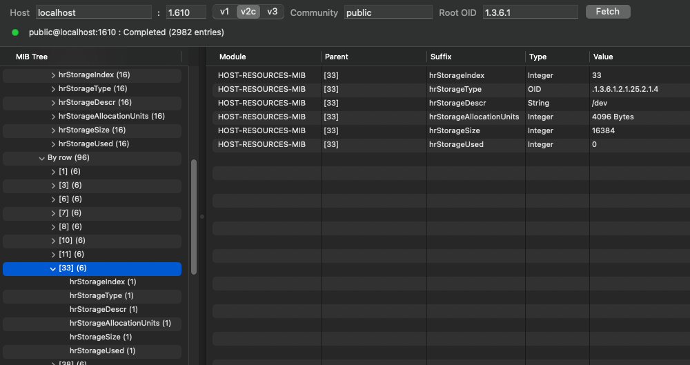

# Session 5 - Performance

[Main Menu](../workup/README.md) | [Session 5](../session5/README.md)

TBD

Introduction to performance collection
parsing mibs
grafana and mibs

snmp data collection


Fetch the System Object ID from a Linux server
```
ssh admin@localhost -p 8101 snmp-walk -l Default 192.168.42.34 .1.3.6.1.2.1.1.2
[.1.3.6.1.2.1.1.2].[0] = .1.3.6.1.4.1.8072.3.2.10
```
# Collecting from an SNMP Table

## Step 1: Create a resource type for entries in the table


File: `etc/resource-types.d/host-resource-storage.xml`

```xml
<?xml version="1.0"?>
<resource-types>
    <resourceType name="hrStorageIndex" label="Host Resources Storage" resourceLabel="${hrStorageDescr}">
        <persistenceSelectorStrategy class="org.opennms.netmgt.collection.support.PersistAllSelectorStrategy"/>
        <storageStrategy class="org.opennms.netmgt.dao.support.SiblingColumnStorageStrategy">
            <parameter key="sibling-column-name" value="hrStorageDescr"/>
            <parameter key="replace-first" value="s/^-$/_root_fs/"/>
            <parameter key="replace-all" value="s/^-//"/>
            <parameter key="replace-all" value="s/\s//"/>
            <parameter key="replace-all" value="s/:\\.*//"/>
        </storageStrategy>
    </resourceType>
</resource-types>
```

## Step 2: Create data-collection group

Define which metrics you want to collect on which SNMP agent, in our case identified by system object ID: `.1.3.6.1.4.1.61509.42.1`



File: `etc/datacollection/tutorial-snmp.xml`

```xml
<datacollection-group xmlns="http://xmlns.opennms.org/xsd/config/datacollection" name="tutorial-snmp-collection-group">
    <group name="host-resources-storage" ifType="all">
        <mibObj oid=".1.3.6.1.2.1.25.2.3.1.2" instance="hrStorageIndex" alias="hrStorageType" type="string"/>
        <mibObj oid=".1.3.6.1.2.1.25.2.3.1.3" instance="hrStorageIndex" alias="hrStorageDescr" type="string"/>
        <mibObj oid=".1.3.6.1.2.1.25.2.3.1.4" instance="hrStorageIndex" alias="hrStorageAllocUnits" type="gauge"/>
        <mibObj oid=".1.3.6.1.2.1.25.2.3.1.5" instance="hrStorageIndex" alias="hrStorageSize" type="gauge"/>
        <mibObj oid=".1.3.6.1.2.1.25.2.3.1.6" instance="hrStorageIndex" alias="hrStorageUsed" type="gauge"/>
    </group>
    <systemDef name="Tutorial-SNMP-System">
        <sysoid>.1.3.6.1.4.1.61509.42.1</sysoid>
        <collect>
            <includeGroup>host-resources-storage</includeGroup>
        </collect>
    </systemDef>
</datacollection-group>
```

## Step 3: Associate a data collection group to an SNMP collection

File: `etc/datacollection-config.xml`

```xml
<snmp-collection name="tutorial-snmp-collection" snmpStorageFlag="select">
   <rrd step="30">
      <rra>RRA:AVERAGE:0.5:1:20160</rra>
      <rra>RRA:AVERAGE:0.5:12:14880</rra>
      <rra>RRA:AVERAGE:0.5:288:3660</rra>
      <rra>RRA:MAX:0.5:288:3660</rra>
      <rra>RRA:MIN:0.5:288:3660</rra>
   </rrd>
   <include-collection dataCollectionGroup="tutorial-snmp-collection-group"/>
</snmp-collection>
```

## Step 4: Define an SNMP collection service with the SNMP collection

File: `etc/collectd-configuration.xml`

```xml
<package name="Tutorial-SNMP-Package" remote="false">
   <filter>IPADDR != '0.0.0.0'</filter>
   <include-range begin="1.1.1.1" end="254.254.254.254"/>
   <include-range begin="::1" end="ffff:ffff:ffff:ffff:ffff:ffff:ffff:ffff"/>
   <service name="SNMP-Custom-Agent" interval="30000" user-defined="false" status="on">
      <parameter key="collection" value="tutorial-snmp-collection"/>
      <parameter key="thresholding-enabled" value="true"/>
   </service>
</package>
```

## Step 5: Verify data collection

```
ls core-data/
```
